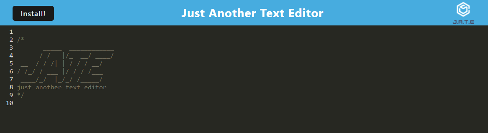

# Just Another Text Editor

## Description
A text editor that runs in the browser and is a single-page application that meets the PWA criteria. Additionally, it features a number of data persistence techniques that serve as redundancy in case one of the options is not supported by the browser. The application also functions offline.  

## Table of Contents

- [Installation](#installation)
- [Usage](#usage)
- [Credits](#credits)
- [License](#license)
- [How to Contribute](#guidelines)
- [Tests](#tests)
- [Questions](#questions)

## Installation

[Deployed Application](https://text-editor-db4t.onrender.com/)

## Usage

Simply type to take notes with Javascript highlighting.

## Credits

* Node.js Copyright [OpenJS Foundation](https://openjsf.org/) and Node.js contributors. All rights reserved. 
* Babel Copyright © 2014-present Sebastian McKenzie and other contributors
* Babel Loader Copyright © 2014-2019 [Luís Couto](mailto:hello@luiscouto.pt)
* HTTP-Server Copyright © 2011-2022 Charlie Robbins, Marak Squires, Jade Michael Thornton and the Contributors.
* Workbox Copyright © 2018 Google LLC
* IDB Copyright © 2016, [Jake Archibald](mailto:jaffathecake@gmail.com)
* CSS Loader, HTML-Webpack-Plugin, Style-Loader, and Webpack all Copyright JS Foundation and other contributors
* Express.js Copyright © 2017 StrongLoop, IBM, and other expressjs.com contributors.
* if-env Copyright © 2015 Eric Clemmons
* Concurrently Copyright (c) 2015 Kimmo Brunfeldt
* Nodemon Copyright (c) 2010 - present, [Remy Sharp](mailto:<remy@remysharp.com>) ([remysharp.com](https://remysharp.com))

## License

This application is covered under the MIT License.

## How To Contribute

N/A

## Tests

N/A

## Questions

[GitHub Profile](https://github.com/kevinchogan)

For questions, please contact kchogan@pacbell.net.
